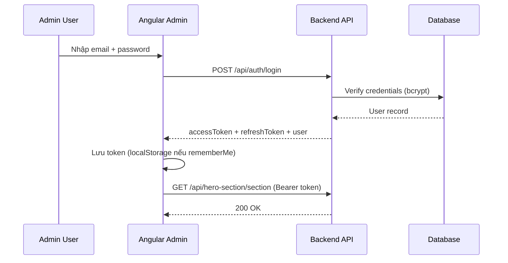

# AUTH — Tài liệu API Login & Bảo mật Admin

Tài liệu chuẩn để **Backend implement API đăng nhập** và **Frontend tích hợp bảo mật** cho Admin Panel.

| Thuộc tính | Giá trị |
|------------|---------|
| Public route | `/admin/login` |
| Protected routes | `/admin/*` (trừ login) |
| FE component | `LoginComponent` |
| FE store | `src/app/features/admin/store/auth.store.ts` |
| FE service | `src/app/features/admin/services/auth.service.ts` |
| FE guard | `src/app/features/admin/guards/auth.guard.ts` |
| FE interceptor | `src/app/features/admin/interceptors/auth.interceptor.ts` |
| API constants | `API_ENDPOINTS.AUTH_*` trong `api.constants.ts` |

> **Lưu ý:** Auth **không có trang cấu hình trong Admin**. Chỉ cần 1 tài khoản admin (hoặc vài user) trong database backend. UI login đã có sẵn.

---

## Có cần token không?

**Có — bắt buộc dùng JWT (JSON Web Token).**

| Câu hỏi | Trả lời |
|---------|---------|
| Login trả về gì? | `accessToken` (JWT) + thông tin `user` |
| FE gửi token thế nào? | Header `Authorization: Bearer {accessToken}` |
| API public Home có cần token? | **Không** — `GET /api/public/*`, `POST /api/contact` |
| API admin CRUD có cần token? | **Có** — mọi `POST/PUT/PATCH/DELETE` và hầu hết `GET` admin |
| Token hết hạn? | Backend trả `401` → FE logout và redirect `/admin/login` |
| Remember me? | FE lưu token + user vào `localStorage` (`admin_token`, `admin_user`) |

### Luồng đăng nhập (recommended)



---

## Quy tắc chung

| Quy tắc | Mô tả |
|---------|-------|
| Response wrapper | `{ success, data, message?, timestamp }` — theo `ApiResponse<T>` |
| Password | **Không bao giờ** trả password trong response; hash bcrypt/argon2 ở DB |
| Access token TTL | Khuyến nghị **15 phút – 1 giờ** |
| Refresh token TTL | Khuyến nghị **7–30 ngày** (lưu httpOnly cookie hoặc DB) |
| Role | FE hiện dùng `user.role` (string) — backend nên trả `"ADMIN"` |
| Rate limit login | Khuyến nghị 5–10 lần/phút/IP để chống brute force |
| HTTPS | Bắt buộc ở production |

---

## Bảng endpoint tổng hợp

| Endpoint | Method | Auth | Mô tả |
|----------|--------|------|-------|
| `/api/auth/login` | POST | ❌ Public | Đăng nhập, trả token + user |
| `/api/auth/logout` | POST | ✅ Bearer | Huỷ refresh token / blacklist access token |
| `/api/auth/refresh` | POST | 🔄 Refresh token | Lấy access token mới |
| `/api/auth/me` | GET | ✅ Bearer | Lấy profile user hiện tại (validate session) |

Constant FE: `AUTH_LOGIN`, `AUTH_LOGOUT`, `AUTH_REFRESH`, `AUTH_ME`.

---

## 1. Login — `POST /api/auth/login`

**Route FE:** `/admin/login`  
**Không cần header Authorization.**

### Request body

| Field | Type | Required | Mô tả |
|-------|------|----------|-------|
| `email` | string | ✅ | Email hoặc username admin |
| `password` | string | ✅ | Mật khẩu plain (chỉ trên HTTPS) |
| `rememberMe` | boolean | ❌ | FE dùng để quyết định lưu localStorage |

```json
{
  "email": "admin@yenhs.dev",
  "password": "your-secure-password",
  "rememberMe": true
}
```

### Response 200

```json
{
  "success": true,
  "data": {
    "accessToken": "eyJhbGciOiJIUzI1NiIsInR5cCI6IkpXVCJ9...",
    "refreshToken": "dGhpcy1pcy1hLXJlZnJlc2gtdG9rZW4...",
    "expiresIn": 3600,
    "user": {
      "id": "550e8400-e29b-41d4-a716-446655440000",
      "email": "admin@yenhs.dev",
      "name": "Yen Hoang",
      "avatar": "https://cdn.example.com/avatars/admin.jpg",
      "role": "ADMIN"
    }
  },
  "message": "Login successful",
  "timestamp": "2026-07-02T10:00:00Z"
}
```

### Mapping FE

| API field | FE binding |
|-----------|------------|
| `data.accessToken` | `AuthStore._token` → `localStorage.admin_token` |
| `data.user` | `AuthStore._user` → `localStorage.admin_user` |
| `data.refreshToken` | Lưu riêng (httpOnly cookie khuyến nghị) hoặc `localStorage.admin_refresh_token` |

### Response lỗi

| HTTP | Khi nào | Body |
|------|---------|------|
| 400 | Thiếu email/password | `{ success: false, error: { code: "VALIDATION_ERROR", ... } }` |
| 401 | Sai credentials | `{ success: false, error: { code: "AUTH_UNAUTHORIZED", message: "Invalid email or password" } }` |
| 429 | Quá nhiều lần thử | `{ success: false, error: { code: "RATE_LIMIT", ... } }` |

---

## 2. Logout — `POST /api/auth/logout`

**Auth:** `Authorization: Bearer {accessToken}`

### Request body (optional)

```json
{
  "refreshToken": "dGhpcy1pcy1hLXJlZnJlc2gtdG9rZW4..."
}
```

### Response 200

```json
{
  "success": true,
  "data": null,
  "message": "Logged out",
  "timestamp": "2026-07-02T10:05:00Z"
}
```

### FE behavior

1. Gọi API logout (best effort)
2. `AuthStore.logout()` — xóa `admin_token`, `admin_user`
3. Redirect `/admin/login`

---

## 3. Refresh token — `POST /api/auth/refresh`

Dùng khi access token hết hạn mà user vẫn còn session.

### Cách 1 — Body (FE hiện tại dễ tích hợp)

```json
{
  "refreshToken": "dGhpcy1pcy1hLXJlZnJlc2gtdG9rZW4..."
}
```

### Cách 2 — httpOnly cookie (bảo mật hơn, khuyến nghị production)

- Backend set cookie `refreshToken` khi login
- FE gọi `POST /api/auth/refresh` không cần body
- Cookie tự gửi kèm request

### Response 200

```json
{
  "success": true,
  "data": {
    "accessToken": "eyJnew...",
    "expiresIn": 3600
  },
  "timestamp": "2026-07-02T10:30:00Z"
}
```

### Response 401

Refresh token invalid/expired → FE logout hoàn toàn.

---

## 4. Me — `GET /api/auth/me`

Validate token khi app load hoặc sau F5.

**Auth:** `Authorization: Bearer {accessToken}`

### Response 200

```json
{
  "success": true,
  "data": {
    "id": "550e8400-e29b-41d4-a716-446655440000",
    "email": "admin@yenhs.dev",
    "name": "Yen Hoang",
    "avatar": "https://cdn.example.com/avatars/admin.jpg",
    "role": "ADMIN"
  },
  "timestamp": "2026-07-02T10:00:00Z"
}
```

### FE usage

- App khởi động: nếu có `admin_token` trong localStorage → gọi `/api/auth/me`
- 200 → giữ session
- 401 → xóa storage, redirect login

---

## JWT payload gợi ý

```json
{
  "sub": "550e8400-e29b-41d4-a716-446655440000",
  "email": "admin@yenhs.dev",
  "role": "ADMIN",
  "iat": 1719900000,
  "exp": 1719903600
}
```

Backend middleware:

1. Đọc header `Authorization: Bearer ...`
2. Verify signature + expiry
3. Gắn `req.user` cho controller admin
4. Role `ADMIN` mới được CRUD

---

## Database gợi ý — bảng `admin_users`

| Column | Type | Mô tả |
|--------|------|-------|
| `id` | UUID PK | |
| `email` | VARCHAR UNIQUE | Login identifier |
| `password_hash` | VARCHAR | bcrypt cost 12+ |
| `name` | VARCHAR | Hiển thị topbar |
| `avatar` | VARCHAR | URL ảnh |
| `role` | ENUM | `ADMIN` |
| `is_active` | BOOLEAN | Khóa tài khoản |
| `last_login_at` | TIMESTAMP | |
| `created_at` | TIMESTAMP | |
| `updated_at` | TIMESTAMP | |

**Bảng `refresh_tokens` (optional):**

| Column | Type |
|--------|------|
| `id` | UUID |
| `user_id` | FK → admin_users |
| `token_hash` | VARCHAR |
| `expires_at` | TIMESTAMP |
| `revoked_at` | TIMESTAMP NULL |

---

## Phân quyền API toàn hệ thống

| Nhóm API | Auth | Ví dụ |
|----------|------|-------|
| **Public read** | Không | `GET /api/public/hero-section` |
| **Public write** | Không (+ rate limit) | `POST /api/contact` |
| **Admin read/write** | Bearer JWT | `PUT /api/hero-section/section` |
| **Upload** | Bearer JWT | `POST /api/upload/image` |
| **Messages inbox** | Bearer JWT | `GET /api/messages` |

---

## Phân quyền chi tiết — Cách chia quyền

### Nguyên tắc cốt lõi

Portfolio này có **2 loại người dùng**, không phải hệ thống multi-tenant phức tạp:

| Loại | Ai | Làm gì |
|------|-----|--------|
| **Khách (Anonymous)** | Mọi người truy cập trang Home | Xem portfolio, gửi form liên hệ |
| **Admin** | Chủ portfolio (bạn) | Đăng nhập, sửa nội dung, đọc tin nhắn |

> **Khuyến nghị cho dự án này:** Chỉ cần **1 role `ADMIN`**. Không cần Editor/Viewer trừ khi sau này có nhiều người cùng quản lý.

**Quan trọng:** Phân quyền thật sự nằm ở **Backend**, không phải Frontend.
- FE `authGuard` chỉ **ẩn UI** — ai biết URL vẫn gọi API được nếu backend không check token.
- Backend **bắt buộc** verify JWT trên mọi route admin.

---

### Sơ đồ 3 vùng truy cập

```
┌─────────────────────────────────────────────────────────────┐
│  VÙNG 1 — PUBLIC (không token)                              │
│  • Trang Home: hero, career, skills, projects, contact...   │
│  • GET /api/public/*                                        │
│  • POST /api/contact (form)                                 │
└─────────────────────────────────────────────────────────────┘

┌─────────────────────────────────────────────────────────────┐
│  VÙNG 2 — AUTH (login, không cần token trước khi gọi)       │
│  • POST /api/auth/login                                     │
└─────────────────────────────────────────────────────────────┘

┌─────────────────────────────────────────────────────────────┐
│  VÙNG 3 — ADMIN (bắt buộc Bearer JWT, role = ADMIN)       │
│  • /admin/* UI (FE guard)                                   │
│  • PUT/POST/DELETE /api/hero-section/*                      │
│  • GET /api/messages, POST /api/upload/*                    │
│  • GET /api/auth/me, POST /api/auth/logout                  │
└─────────────────────────────────────────────────────────────┘
```

---

### Bảng phân quyền theo từng endpoint

#### A. Không cần đăng nhập (Public)

| Endpoint | Method | Ai được gọi | Backend check |
|----------|--------|-------------|---------------|
| `/api/public/hero-section` | GET | Ai cũng được | Không token |
| `/api/public/educational` | GET | Ai cũng được | Không token |
| `/api/public/career-journey` | GET | Ai cũng được | Không token |
| `/api/public/tech-stack` | GET | Ai cũng được | Không token |
| `/api/public/featured-projects` | GET | Ai cũng được | Không token |
| `/api/public/contact-section` | GET | Ai cũng được | Không token |
| `/api/public/footer-section` | GET | Ai cũng được | Không token |
| `/api/contact` | POST | Ai cũng được | **Rate limit** + validate form (không JWT) |
| `/api/auth/login` | POST | Ai cũng được | Rate limit chống brute force |

**Lưu ý public read:** Response chỉ trả field `isActive = true`. Không lộ draft/inactive items.

#### B. Cần đăng nhập (Admin — JWT)

| Endpoint | Method | Role | Backend check |
|----------|--------|------|---------------|
| `/api/auth/me` | GET | ADMIN | Token hợp lệ |
| `/api/auth/logout` | POST | ADMIN | Token hợp lệ |
| `/api/auth/refresh` | POST | ADMIN | Refresh token hợp lệ |
| `/api/hero-section/**` | GET/PUT/POST/DELETE/PATCH | ADMIN | JWT + role |
| `/api/educational/**` | GET/PUT/POST/DELETE/PATCH | ADMIN | JWT + role |
| `/api/career-journey/**` | GET/PUT/POST/DELETE/PATCH | ADMIN | JWT + role |
| `/api/tech-stack/**` | GET/PUT/POST/DELETE/PATCH | ADMIN | JWT + role |
| `/api/featured-projects/**` | GET/PUT/POST/DELETE/PATCH | ADMIN | JWT + role |
| `/api/contact-section/**` | GET/PUT/POST/DELETE/PATCH | ADMIN | JWT + role |
| `/api/footer-section/**` | GET/PUT/POST/DELETE/PATCH | ADMIN | JWT + role |
| `/api/messages/**` | GET/PATCH/DELETE | ADMIN | JWT + role |
| `/api/upload/image` | POST | ADMIN | JWT + role |
| `/api/upload/file` | POST | ADMIN | JWT + role |

**Không có endpoint admin nào cho khách vãng lai** — nếu thiếu token → `401 Unauthorized`.

---

### 401 vs 403 — Khác nhau thế nào?

| HTTP | Ý nghĩa | Khi nào trả |
|------|---------|-------------|
| **401 Unauthorized** | Chưa đăng nhập / token hết hạn / token sai | Không gửi header, token invalid, token expired |
| **403 Forbidden** | Đã đăng nhập nhưng **không đủ quyền** | Token hợp lệ nhưng role không phải ADMIN (nếu sau này có nhiều role) |

**Với 1 role ADMIN duy nhất:** Hầu hết chỉ cần xử lý **401**. 403 dùng khi mở rộng role sau này.

---

### Luồng Backend kiểm tra quyền (middleware)

Mọi request admin đi qua pipeline:

```
Request
  │
  ▼
[1] CORS / Rate limit
  │
  ▼
[2] Route match
  │
  ├── /api/public/*  ──► Bỏ qua auth ──► Controller ──► Response
  ├── /api/auth/login ──► Bỏ qua auth ──► Controller
  ├── /api/contact POST ──► Rate limit ──► Controller
  │
  └── /api/** (admin) ──► [3] Auth Middleware
                              │
                              ├── Không có Authorization? → 401
                              ├── Token invalid/expired?  → 401
                              ├── role !== ADMIN?         → 403
                              └── OK → gắn req.user → Controller
```

**Ví dụ Spring Boot / NestJS / Express:**

```typescript
// Pseudo-code middleware
function requireAdmin(req, res, next) {
  const header = req.headers.authorization;
  if (!header?.startsWith('Bearer ')) {
    return res.status(401).json({ success: false, error: { code: 'AUTH_UNAUTHORIZED' } });
  }
  const payload = verifyJwt(header.slice(7));
  if (!payload) return res.status(401).json(...);
  if (payload.role !== 'ADMIN') return res.status(403).json(...);
  if (user.is_active === false) return res.status(403).json(...);
  req.user = payload;
  next();
}
```

Áp middleware này cho **toàn bộ** route `/api/hero-section`, `/api/messages`, … — **trừ** `/api/public/*`, `/api/auth/login`, `POST /api/contact`.

---

### Luồng Frontend (chỉ UX, không thay backend)

| Lớp FE | File | Việc làm |
|--------|------|----------|
| **Route guard** | `auth.guard.ts` | Chặn vào `/admin/dashboard` nếu chưa login |
| **Guest guard** | `auth.guard.ts` | Đã login thì không vào `/admin/login` |
| **Auth store** | `auth.store.ts` | Giữ token + user trong memory/localStorage |
| **Interceptor** | `auth.interceptor.ts` | Tự gắn `Authorization: Bearer {token}` mọi HTTP call |
| **401 handler** | interceptor | Logout + redirect `/admin/login` |

```
User mở /admin/hero-section
  │
  ▼
authGuard: có token + user? ──No──► redirect /admin/login
  │
 Yes
  ▼
Load page → gọi PUT /api/hero-section/section
  │
  ▼
Interceptor gắn Bearer token
  │
  ▼
Backend verify → 200 OK hoặc 401 → FE logout
```

**Trang Home public** không qua `authGuard`, không gửi token — chỉ gọi `GET /api/public/*`.

---

### POST /api/contact — Trường hợp đặc biệt

Form liên hệ là **public write** — khách không login vẫn gửi được.

| Biện pháp | Mô tả |
|-----------|-------|
| Không JWT | Ai cũng submit được |
| Rate limit | VD: 5 request / 15 phút / IP |
| Validation | Email, name, message required |
| CAPTCHA (optional) | Turnstile/reCAPTCHA nếu bị spam |
| Không trả dữ liệu nhạy cảm | Response chỉ `{ success: true, message: "Sent" }` |

Admin **đọc** tin nhắn qua `GET /api/messages` — **bắt buộc JWT**.

---

### Token gắn với quyền như thế nào?

JWT **không phải** “quyền lưu riêng” — quyền nằm trong **payload**:

```json
{
  "sub": "user-uuid",
  "email": "admin@yenhs.dev",
  "role": "ADMIN",
  "exp": 1719903600
}
```

Backend mỗi request:
1. Verify chữ ký JWT (secret/key pair)
2. Check `exp` chưa hết hạn
3. Check `role === 'ADMIN'`
4. (Optional) Check user còn `is_active` trong DB

**Access token ngắn** (15–60 phút) + **refresh token dài** (7–30 ngày):
- Token hết hạn → FE gọi `/api/auth/refresh` hoặc login lại
- Logout → revoke refresh token ở DB

---

### Có cần nhiều role không?

| Kịch bản | Role đề xuất |
|----------|--------------|
| **Chỉ bạn 1 người quản lý** (hiện tại) | `ADMIN` duy nhất — đủ |
| Sau này thuê người viết blog | Thêm `EDITOR` — chỉ blogs, không settings |
| Sau này người chỉ xem inbox | Thêm `VIEWER` — chỉ GET messages |

**Giai đoạn 1:** Implement `ADMIN` only. Schema DB để `role ENUM('ADMIN')` — mở rộng sau không khó.

---

### Ma trận tóm tắt: Ai làm được gì?

| Hành động | Khách (Home) | Admin (đã login) |
|-----------|:------------:|:----------------:|
| Xem trang Home | ✅ | ✅ |
| Gửi form contact | ✅ | ✅ |
| Gọi GET /api/public/* | ✅ | ✅ |
| Vào /admin/* | ❌ (redirect login) | ✅ |
| Sửa Hero, Footer, … | ❌ | ✅ |
| Upload ảnh | ❌ | ✅ |
| Đọc/xóa messages | ❌ | ✅ |
| Gọi POST /api/auth/login | ✅ | ✅ |

---

### Checklist Backend phân quyền

- [ ] Tách route public (`/api/public/*`) không qua auth middleware
- [ ] `POST /api/auth/login` public + rate limit
- [ ] `POST /api/contact` public + rate limit + validation
- [ ] Mọi route CRUD section bọc `requireAdmin`
- [ ] JWT chứa `role`, verify mỗi request
- [ ] Trả 401 khi thiếu/sai token; 403 khi sai role
- [ ] Public aggregate **không** trả item `isActive: false`
- [ ] Không expose admin GET list qua URL public (dùng `/api/public/*` riêng)

---

## Kiến trúc API tổng thể (portfolio này)

Backend nên thiết kế **3 lớp**:

### Lớp 1 — Auth (làm trước)

```
POST /api/auth/login
POST /api/auth/logout
POST /api/auth/refresh
GET  /api/auth/me
```

### Lớp 2 — Public Home (7 aggregate — không token)

Mỗi section 1 endpoint gộp, giảm số request FE:

| Endpoint | Section Home | Doc |
|----------|--------------|-----|
| `GET /api/public/hero-section` | `#home` | `hero.md` |
| `GET /api/public/educational` | `#career` | `educational.md` |
| `GET /api/public/career-journey` | `#experience` | `experience.md` |
| `GET /api/public/tech-stack` | `#skills` | `skills.md` |
| `GET /api/public/featured-projects` | `#projects` | `projects.md` |
| `GET /api/public/contact-section` | `#contact` | `contact.md` |
| `GET /api/public/footer-section` | Footer | `footer.md` |

Thêm:

| Endpoint | Mô tả |
|----------|-------|
| `POST /api/contact` | Form liên hệ → lưu messages |

### Lớp 3 — Admin CRUD (JWT bắt buộc)

Mirror từng module admin — pattern chung:

- **Singleton:** `GET` + `PUT` (section config, avatar, map…)
- **Collection:** `GET` list + `POST` + `PUT /:id` + `DELETE /:id` + `PATCH /:id/status`

Chi tiết từng module xem doc tương ứng trong `doc/`.

### Lớp 4 — Dịch vụ dùng chung (JWT)

| Endpoint | Mô tả |
|----------|-------|
| `POST /api/upload/image` | Upload avatar, ảnh project |
| `POST /api/upload/file` | Upload CV, file đính kèm |
| `GET/PATCH/DELETE /api/messages` | Inbox admin |

---

## Thứ tự triển khai backend đề xuất

| Phase | Việc cần làm |
|-------|---------------|
| **1** | Auth: login, me, logout, refresh + JWT middleware |
| **2** | Upload service |
| **3** | `POST /api/contact` + Messages CRUD |
| **4** | 7 public aggregate endpoints |
| **5** | Admin CRUD từng section (hero → footer) |
| **6** | Wire FE: thay localStorage mock bằng HttpClient |

---

## Checklist tích hợp FE

- [ ] `AuthStore.login()` gọi `POST /api/auth/login` thay mock
- [ ] Lưu `accessToken` → key `admin_token` (đồng bộ interceptor)
- [ ] Interceptor gắn `Authorization: Bearer {token}` — dùng `AuthStore`, không dùng key `auth_token` riêng
- [ ] `401` → logout + redirect login (đã có trong admin interceptor)
- [ ] App init: có token → gọi `GET /api/auth/me`
- [ ] `rememberMe = false` → chỉ giữ token trong memory (session), không localStorage
- [ ] Refresh token flow trước khi access token hết hạn (optional nâng cao)

---

## Demo credentials (development only)

FE login page hiện hiển thị demo — **xóa ở production**.

Backend seed 1 admin user:

```
email: admin@yenhs.dev
password: (set via env / seed script, không hardcode)
```

---

## File liên quan

```
src/app/features/admin/pages/login/login.component.ts
src/app/features/admin/store/auth.store.ts
src/app/features/admin/services/auth.service.ts
src/app/features/admin/guards/auth.guard.ts
src/app/features/admin/interceptors/auth.interceptor.ts
src/app/core/constants/api.constants.ts  → AUTH_*
src/app/core/models/api-response.interface.ts
```
