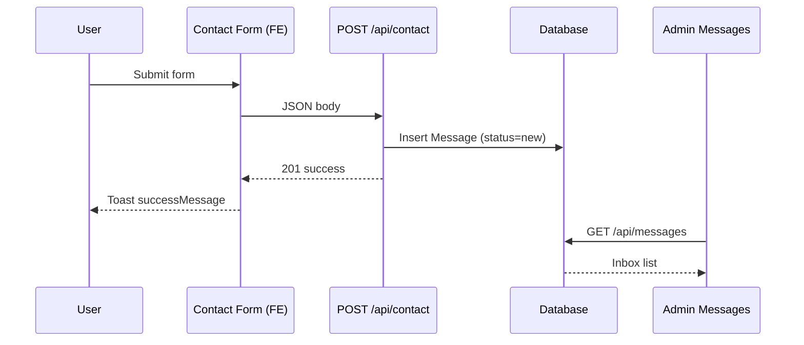

# Section CONTACT — Tài liệu API & Field Mapping

Tài liệu chuẩn để **Backend implement API** và **Frontend map dữ liệu** cho section **CONTACT** trên trang Home (`#contact`).

| Thuộc tính | Giá trị |
|------------|---------|
| Anchor trang | `#contact` |
| **Section type** | **`1`** |
| Public component | `ContactComponent` |
| Admin route | `/admin/contact-section` |
| Model | `src/app/features/admin/models/contact-section.model.ts` |
| Service | `src/app/features/admin/services/contact-section.service.ts` |
| Store | `src/app/features/admin/store/contact-section.store.ts` |
| Type constant | `section-type.constants.ts` → `SECTION_API_TYPE = 1` |
| API constants | `CONTACT_*` (`/api/admin/contact/*?type=1`) |
| Backend doc | `portfolio-api/doc/contact.md` |
| Form submit API | `POST /api/contact` |

> **Phân biệt section:** Endpoint `/api/admin/contact`, luôn kèm `type: 1`.

> **Lưu ý:** Settings (`/admin/settings` → Contact/Social) và Messages inbox (`/admin/messages`) vẫn tồn tại riêng. Module **Contact Section** là source of truth cho UI Home `#contact`.

---

## Quy tắc chung

| Quy tắc | Mô tả |
|---------|-------|
| Public hiển thị | Chỉ item `isActive = true` (contact info, social) |
| Thứ tự | Sort tăng dần theo `sortOrder` |
| Map / CTA | Toggle `isActive` riêng |
| Form | Toggle `form.enabled` — ẩn form khi false |
| Icon SVG | Lưu string trong DB; FE sanitize qua `DomSanitizer` |
| Response wrapper | `{ success: boolean, data: T, message?: string }` |

---

## Cấu trúc danh mục Admin

```
CONTACT SECTION
├── 0. Cấu hình Section       → ContactSectionConfig
├── 1. Thông tin liên hệ      → ContactInfoItem[]
├── 2. Social links           → ContactSocialItem[]
└── 3. Map, CTA & Form        → ContactMapConfig + ContactCtaConfig + ContactFormSettings
```

---

## Bảng endpoint tổng hợp

| Entity | GET | PUT | POST | DELETE | PATCH status |
|--------|-----|-----|------|--------|--------------|
| Section config | `GET /api/contact-section/section` | `PUT .../section` | — | — | — |
| Contact info | `GET .../info` | `PUT .../info/:id` | `POST .../info` | `DELETE .../info/:id` | `PATCH .../info/:id/status` |
| Social links | `GET .../social` | `PUT .../social/:id` | `POST .../social` | `DELETE .../social/:id` | `PATCH .../social/:id/status` |
| Map | `GET .../map` | `PUT .../map` | — | — | — |
| CTA | `GET .../cta` | `PUT .../cta` | — | — | — |
| Form settings | `GET .../form` | `PUT .../form` | — | — | — |
| **Public aggregate** | `GET /api/public/contact-section` | — | — | — | — |
| **Form submit** | — | — | `POST /api/contact` | — | — |

Constant FE: `CONTACT_SECTION_CONFIG`, `CONTACT_SECTION_INFO`, `CONTACT_SECTION_SOCIAL`, `CONTACT_SECTION_MAP`, `CONTACT_SECTION_CTA`, `CONTACT_SECTION_FORM`, `CONTACT_SECTION_PUBLIC`, `CONTACT`.

---

## 0. Cấu hình Section — `ContactSectionConfig`

**Admin tab:** Cấu hình Section  
**Singleton.**

### Field mapping

| API field | Type | Required | Admin UI label | Public FE binding | CSS / vị trí Home |
|-----------|------|----------|----------------|-------------------|-------------------|
| `sectionTag` | string | ✅ | Section Tag | `section().sectionTag` | `.section-tag` |
| `titleAccent` | string | ✅ | Tiêu đề (Accent) | `section().titleAccent` | `.title-accent` |
| `titleText` | string | ✅ | Tiêu đề (Text) | `section().titleText` | `.title-text` |
| `subtitle` | string | ✅ | Mô tả Section | `section().subtitle` | `.section-subtitle` |
| `infoTitle` | string | ✅ | Tiêu đề khối thông tin | `section().infoTitle` | `.info-title` |
| `formTitle` | string | ✅ | Tiêu đề form | `section().formTitle` | `.form-title` |
| `socialTitle` | string | ✅ | Tiêu đề social | `section().socialTitle` | `.social-title` |

---

## 1. Thông tin liên hệ — `ContactInfoItem`

**Admin tab:** Thông tin liên hệ  
**Public:** Card `.contact-card` — icon + label + value, link optional.

### Field mapping

| API field | Type | Required | Admin UI | Public FE | Ghi chú |
|-----------|------|----------|----------|-----------|---------|
| `id` | string | ✅ | — | track | PK |
| `label` | string | ✅ | Label | `.card-label` | Email, Phone... |
| `value` | string | ✅ | Giá trị hiển thị | `.card-value` | |
| `link` | string | ❌ | Link | `[href]` | mailto:, tel:, https:// |
| `iconSvg` | string | ✅ | Icon SVG | `[innerHTML]` (sanitized) | SVG inline |
| `sortOrder` | number | ✅ | Thứ tự | Thứ tự card | ≥ 1 |
| `isActive` | boolean | ✅ | Active/Inactive | Lọc public | |

### Dữ liệu mẫu

| label | value | link |
|-------|-------|------|
| Email | hungnv.dev@gmail.com | mailto:... |
| Phone | +84 123 456 789 | tel:+84123456789 |
| Location | Ho Chi Minh City, Vietnam | — |
| Portfolio | hungdev.com | https://hungdev.com |

---

## 2. Social links — `ContactSocialItem`

**Admin tab:** Social links  
**Public:** `.social-link` với `--social-color`.

### Field mapping

| API field | Type | Required | Admin UI | Public FE |
|-----------|------|----------|----------|-----------|
| `id` | string | ✅ | — | track |
| `name` | string | ✅ | Tên | track, hover state |
| `url` | string | ✅ | URL | `[href]` |
| `color` | string (hex) | ✅ | Màu accent | `[style.--social-color]` |
| `iconSvg` | string | ✅ | Icon SVG | `[innerHTML]` |
| `sortOrder` | number | ✅ | Thứ tự | Thứ tự icon |
| `isActive` | boolean | ✅ | Active/Inactive | Lọc public |

---

## 3. Map — `ContactMapConfig`

**Admin tab:** Map, CTA & Form (block Map)

| API field | Type | Required | Public FE |
|-----------|------|----------|-----------|
| `icon` | string | ❌ | `.map-icon` (emoji) |
| `text` | string | ✅ | `.map-text` |
| `googleMapUrl` | string | ❌ | **Chưa embed iframe** |
| `isActive` | boolean | ✅ | Ẩn/hiện `.map-placeholder` |

---

## 4. CTA — `ContactCtaConfig`

**Admin tab:** Map, CTA & Form (block CTA)

| API field | Type | Required | Public FE |
|-----------|------|----------|-----------|
| `title` | string | ✅ | `.cta-title` |
| `description` | string | ✅ | `.cta-description` |
| `primaryLabel` | string | ✅ | Nút Hire Me |
| `primaryLink` | string | ✅ | `[href]` primary |
| `secondaryLabel` | string | ✅ | Nút Download CV |
| `secondaryLink` | string | ✅ | `[href]` CV file |
| `isActive` | boolean | ✅ | Ẩn/hiện `.cta-section` |

---

## 5. Form settings — `ContactFormSettings`

**Admin tab:** Map, CTA & Form (block Form)

| API field | Type | Required | Public FE |
|-----------|------|----------|-----------|
| `enabled` | boolean | ✅ | Ẩn/hiện `.contact-form-wrapper` |
| `messageMaxLength` | number | ✅ | `[maxlength]` + char count |
| `successMessage` | string | ✅ | Toast sau submit mock |

Form field labels (Full Name, Email...) **hardcoded HTML** — có thể mở rộng sau.

---

## 6. Contact form submit — `POST /api/contact`

**Public form fields:**

| Field | Type | Required | Max | Map → Message API |
|-------|------|----------|-----|-------------------|
| `name` | string | ✅ | — | `fullName` |
| `email` | string | ✅ | — | `email` |
| `phone` | string | ❌ | 20 | `phone` |
| `subject` | string | ✅ | 150 | `subject` |
| `message` | string | ✅ | `messageMaxLength` | `message` |

**Request:**

```json
{
  "fullName": "John Doe",
  "email": "john@example.com",
  "phone": "+84 123 456 789",
  "subject": "Project Inquiry",
  "message": "Tell me about your project..."
}
```

**Response 201:**

```json
{
  "success": true,
  "message": "Message sent successfully",
  "data": { "id": "msg-uuid", "createdAt": "2026-07-01T10:00:00Z" }
}
```

**Trạng thái FE hiện tại:** Mock `setTimeout` 2s → toast `successMessage` → reset form. Chưa gọi API.

**Admin Messages:** Tin nhắn sau khi wire API hiển thị tại `/admin/messages`.

---

## 7. Public aggregate — `GET /api/public/contact-section`

```json
{
  "success": true,
  "data": {
    "section": {
      "sectionTag": "Get In Touch",
      "titleAccent": "LET'S BUILD",
      "titleText": "SOMETHING AMAZING",
      "subtitle": "...",
      "infoTitle": "Contact Information",
      "formTitle": "Send Me a Message",
      "socialTitle": "Connect With Me"
    },
    "contactInfo": [
      { "id": "1", "label": "Email", "value": "hungnv.dev@gmail.com", "link": "mailto:...", "iconSvg": "<svg...>", "sortOrder": 1 }
    ],
    "socialLinks": [
      { "id": "1", "name": "GitHub", "url": "https://...", "color": "#ffffff", "iconSvg": "<svg...>", "sortOrder": 1 }
    ],
    "map": { "icon": "📍", "text": "Ho Chi Minh City, Vietnam", "googleMapUrl": "", "isActive": true },
    "cta": { "title": "...", "description": "...", "primaryLabel": "Hire Me", "primaryLink": "#contact", "secondaryLabel": "Download CV", "secondaryLink": "#", "isActive": true },
    "form": { "enabled": true, "messageMaxLength": 500, "successMessage": "Tin nhắn đã được gửi thành công!" }
  }
}
```

---

## 8. Validation rules

| Entity | Field | Rule |
|--------|-------|------|
| Contact info | `label`, `value` | 1–100 ký tự |
| Contact info | `link` | URL/mailto/tel hoặc empty |
| Contact info | `iconSvg` | SVG string hợp lệ |
| Social | `name` | 1–50 ký tự |
| Social | `url` | URL hợp lệ |
| Social | `color` | Hex |
| Form submit | `fullName` | 2–100 ký tự |
| Form submit | `email` | Email hợp lệ |
| Form submit | `message` | 10–500 (hoặc theo `messageMaxLength`) |
| Rate limit | — | 5 req / IP / hour (đề xuất BE) |

---

## 9. Admin UI checklist

- [x] Tab Cấu hình Section (tag, titles, sub-titles)
- [x] Tab Thông tin liên hệ — CRUD + SVG icon + toggle Active
- [x] Tab Social — CRUD + color + SVG + toggle Active
- [x] Tab Map, CTA & Form — map, CTA buttons, form toggle/max length/success message
- [x] Public `ContactComponent` wired qua `ContactSectionStore`
- [x] Toast notification sau submit
- [x] Wire form → `POST /api/contact`
- [x] Admin tab Email — SMTP send + notification receive
- [x] Kết nối API thật (`ContactSectionService` + `ContactSectionStore`)
- [x] Admin inbox `/api/messages` (`MessageService`)

---

## Ghi chú triển khai FE

- **`ContactSectionService`** — gọi HTTP theo `portfolio-api/doc/contact.md`
- **`ContactSectionStore.load()`** — Home `#contact`: `GET /api/public/contact?type=1`
- **`ContactSectionStore.loadAdmin()`** — Admin: 8 GET (section + info + social + map + cta + form + mail send/receive)
- **`ContactSectionStore.submitContact()`** — Home form: `POST /api/contact`
- Tab **Email config** — `PUT /api/admin/contact/mail/send` + `PUT /api/admin/contact/mail/receive`
- **`MessageService`** — Admin inbox `/api/messages`
- API lỗi → fallback mock data

---

## 10. Khác biệt với Settings & Messages

| Contact Section (Home) | Settings `/admin/settings` | Messages |
|------------------------|----------------------------|----------|
| UI cards + social + CTA đầy đủ | email, phone, address flat | Inbox CRUD |
| SVG icon per item | Social URLs only | Reply, folders |
| Section texts + form config | `enableContactForm` (chưa wire Home) | Nhận tin từ form |

Khi tích hợp API production, **ưu tiên `contact-section.model.ts`** cho Home `#contact`. Có thể sync một chiều từ Settings nếu cần single source — nhưng tránh duplicate logic admin.

---

## 11. Luồng end-to-end (sau khi wire API)


